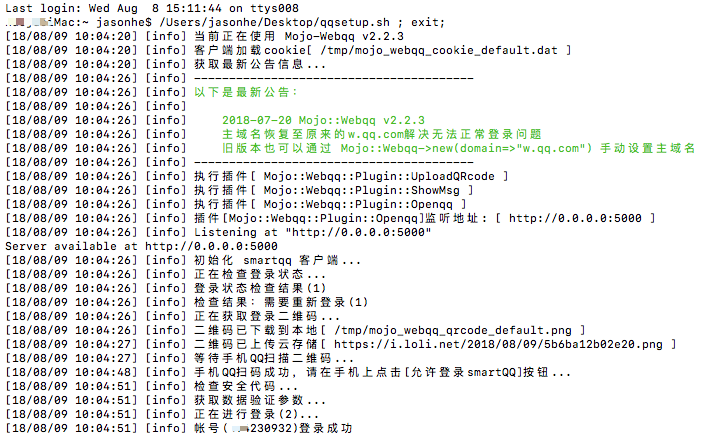
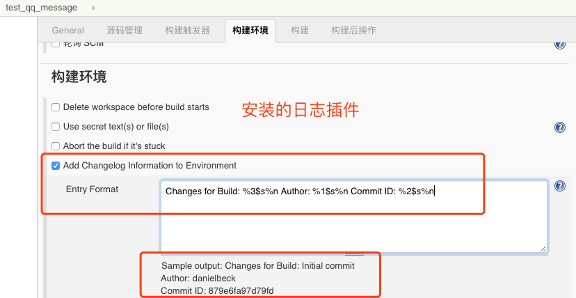
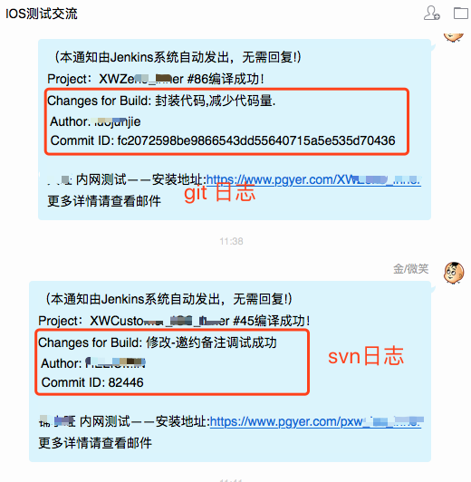

# Jenkins-NotifyQQ
NotifyQQ 运行于Docker  本文介绍mac 环境下实现Jenkins编译结果QQ即时通知
Jenkins 安装使用及iOS自动化打包，邮件通知请参考本人博客：http://www.cnblogs.com/zhujin/p/9064820.html

本文重点讲如何实现Jenkins 编译结果通知到QQ好友及QQ群组。相比邮件通知更及时。
## 一、安装Docker 
https://docs.docker.com/docker-for-mac/install/
### Docker 常用命令：
#### docker images #看镜像
#### docker ps -n 5 #查看容器
#### Docker stop idNun #停止容器
#### docker logs Mojo-Webqq #查看日志
#### docker run  0eba3bfe94c4 #imageID

#### . 删除前需要保证容器是停止的  stop
#### . 需要注意删除镜像和容器的命令不一样。 docker rmi ID  ,其中 容器(rm)  和 镜像(rmi)
#### . 顺序需要先删除容器

#### 可以使用Docker save和Docker load命令来存储和载入镜像。
#### . docker save -o webqq.tar webqq

#### . docker load <webqq.tar

### .将镜像存储
```
docker save webqq > /root/docker-images/webqq.tar
```
### .导入镜像文件
```
docker load --input /root/docker-images/webqq.tar
```
### .通过符号的方式来导入
```
docker load < /root/docker-images/webqq.tar
```
## 二、安装NotifQQ 
地址：https://github.com/zhujin001032/Jenkins-NotifyQQ
### 1.克隆 https://github.com/zhujin001032/Jenkins-NotifyQQ.git 到本地

### 2.在NotifyQQ的根目录里面执行
```
docker build -t webqq .
```
### 3.启动
```
docker run -it --env MOJO_WEBQQ_LOG_ENCODING=utf8 -p 5000:5000 -v /tmp:/tmp webqq 
```
### 4.启动后根据提示打开二维码，手机QQ打开小号扫码登录。相信你懂的

## 三、安装 changelog-environment-plugin 插件
     下载的源码中包含 
     changelog-environment.hpi 
     可以直接使用
## 四、编译jenkins QQ通知插件
### 使用Maven构建，即
```
mvn compile hpi:hpi
```
最终输出NotifyQQ.hpi、NotifyQQ.jar文件，在Jenkins插件管理高级上传安装NotifyQQ.hpi重启Jenkins即可。
下载的源码中包含：
NotifyQQChangelogMessage.hpi
可以直接使用


## 五、截图
* docker 启动webqq 扫码登录


* Jenkin构建环境 设置log格式


* Jenkin构建后 QQ通知 设置


* QQ通知成功发出


## 特别说明：
源代码 参考于： https://github.com/ameizi/NotifyQQ
其给出的插件是依据QQ号或者群号发送消息的，但是现在只能用qq昵称或者群昵称发送消息，因此修改了https://github.com/ameizi/NotifyQQ 源码。
现实通过QQ昵称发消息，并增加了获取svn或者git 修改日志变量至QQ通知消息中。

### 更多参考 https://github.com/zhujin001032/Mojo-Webqq 

### 最后附上自己用的脚本 相信你懂的


